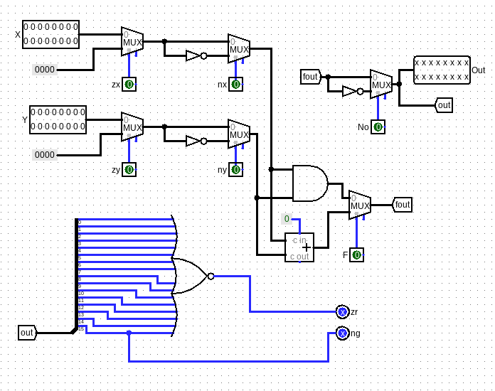
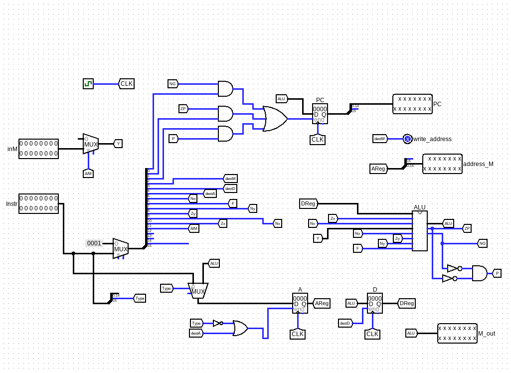

# 16-bit Hack Computer

## Project overview

The following describes in detail how I implemented the **Hack Computer** from the nand2tetris course, which includes:

- The **ALU** and supporting logic
- The **CPU** (registers, program counter, control)
- A Hack **assembler** that translates `.asm` → `.hack`

For full course details and reference material see the nand2tetris site: <https://www.nand2tetris.org>

---

## Hack machine — key specifications

### Instruction formats

- **A-instruction**: `@value`

  - 16 bits -> Low 15 bits hold a decimal constant (or, in the full assembler, a symbol address).

- **C-instruction**: `dest=comp;jump`
  - 16 bits: `111 a c1 c2 c3 c4 c5 c6 d1 d2 d3 j1 j2 j3`
    - `a` — selects A (a=0) vs M (a=1) as second ALU operand
    - `c1..c6` — computation encoding bits
    - `d1..d3` — register destination bits
    - `j1..j3` — jump bits

---

## ALU - Schematic

### ALU operations

- Bitwise: `!D`, `!A`, `!M`, `D&A`, `D|A`, `D&M`, `D|M`
- Arithmetic: `D+1`, `A+1`, `M+1`, `D-1`, `A-1`, `M-1`, `D+A`, `D-A`, `A-D`, `D+M`, `D-M`, `M-D`

---

## CPU — Schematic

### CPU Components

- ALU
- A and D registers
- Program Counter
- Memory Register (read/write)

---

## Assembler

This is a **two-pass assembler written in C++**.

- **Pass 1:** builds a symbol table, mapping labels such as `(LOOP)` and variables to memory or instruction addresses.
- **Pass 2:** translates instructions into 16-bit machine code using the symbol table and lookup tables
